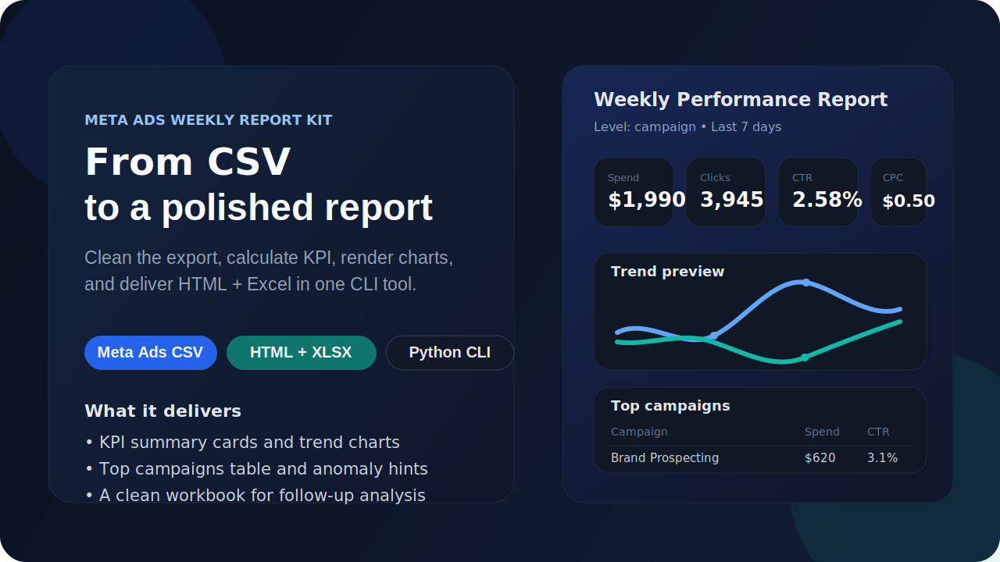
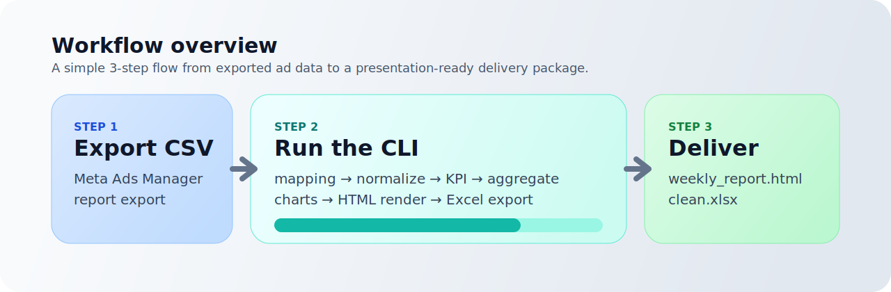

<p align="center">
  
</p>

<h1 align="center">Ads 周报工具包 v0.1</h1>

<p align="center">
  一个把 Meta Ads CSV 快速整理成 <strong>可分享 HTML 周报</strong> 和 <strong>分析用 Excel</strong> 的轻量工具包。
</p>

<p align="center">
  
  
  
  
</p>

<p align="center">
  
  
  
  
</p>

## 目录导航

- [项目定位](#项目定位)
- [效果预览](#效果预览)
- [使用流程](#使用流程)
- [核心能力](#核心能力)
- [快速开始](#快速开始)
- [仓库结构](#仓库结构)
- [作品展示亮点](#作品展示亮点)
- [相关文档](#相关文档)

## 项目定位

这个仓库更像一个可交付的小产品，而不只是一个脚本集合。

它的目标很明确：

1. 从 Meta Ads Manager 导出 CSV 报表
2. 运行一条命令完成清洗、聚合、KPI 计算和可视化
3. 输出一份可直接分享的 HTML 周报，以及一份便于继续分析的 Excel 文件

仓库里同时保留了两部分内容：

- `ads-weekly-report-kit/`：可编辑、可运行、可继续开发的源码项目
- `ads-weekly-report-kit_v0.1.zip`：当前版本的打包压缩包，便于直接分发

## 效果预览

### 1. GitHub 展示预览

<p align="center">
  
</p>

### 2. 处理流程预览

<p align="center">
  
</p>

### 3. 实际产物

- HTML 周报：[`ads-weekly-report-kit/outputs/weekly_report.html`](ads-weekly-report-kit/outputs/weekly_report.html)
- Excel 结果：[`ads-weekly-report-kit/outputs/clean.xlsx`](ads-weekly-report-kit/outputs/clean.xlsx)

## 使用流程

使用节奏：

1. 导出 Meta Ads CSV
2. 通过模板映射识别关键字段
3. 自动做标准化、KPI 计算、按层级聚合
4. 输出 `weekly_report.html` 和 `clean.xlsx`

如果数据里存在有效日期列，且没有显式传入 `--start` / `--end`，程序会默认取最近 7 天作为周报时间窗。

## 核心能力

- 聚焦 Meta Ads 报表场景，范围清晰，适合快速交付
- 自动生成 KPI 摘要、趋势图、Top 表格和异常提示
- 支持 YAML 字段映射，适配不同导出列名
- 支持 `campaign`、`adset`、`ad`、`account` 四种聚合层级
- 输出单文件 HTML 周报，便于直接发给客户或团队成员
- 输出 Excel 清洗结果，方便继续做人工分析或二次建模
- 项目附带基础 smoke tests，便于后续继续迭代

## 快速开始

进入 [`ads-weekly-report-kit/`](ads-weekly-report-kit/) 目录后执行：

```bash
python -m venv .venv
.\.venv\Scripts\activate
pip install -r requirements.txt
pip install -e .
adswk report --input examples/meta_sample.csv --output outputs/ --template meta_ads --level campaign
```

生成结果：

- `outputs/weekly_report.html`
- `outputs/clean.xlsx`

## 仓库结构

```text
.
|-- README.md
|-- .gitignore
|-- assets/
|   |-- github-hero.svg
|   `-- workflow-overview.svg
|-- ads-weekly-report-kit_v0.1.zip
`-- ads-weekly-report-kit/
    |-- README.md
    |-- QUICKSTART.md
    |-- CHANGELOG.md
    |-- requirements.txt
    |-- pyproject.toml
    |-- examples/
    |-- handbook/
    |-- outputs/
    |-- templates/
    |-- tests/
    `-- src/
```

## 作品展示亮点

如果你把这个仓库当作品集项目来看，它比较适合展示这些能力：

- 数据产品思维：输入、处理、输出路径完整
- 工程化意识：命令行接口、模板映射、测试、文档齐全
- 面向交付：不是只做分析，而是能直接生成“给人看”的结果
- 包装意识：同时保留源码版本和压缩包版本，适合演示和分发

## 相关文档

- 项目说明：[`ads-weekly-report-kit/README.md`](ads-weekly-report-kit/README.md)
- 快速开始：[`ads-weekly-report-kit/QUICKSTART.md`](ads-weekly-report-kit/QUICKSTART.md)
- Meta 导出说明：[`ads-weekly-report-kit/handbook/META_EXPORT_GUIDE.md`](ads-weekly-report-kit/handbook/META_EXPORT_GUIDE.md)
- 常见问题：[`ads-weekly-report-kit/handbook/FAQ.md`](ads-weekly-report-kit/handbook/FAQ.md)

## 说明

- 压缩包 `ads-weekly-report-kit_v0.1.zip` 已一并保留在仓库中
- `.venv/`、`__pycache__/` 等本地环境文件已通过 `.gitignore` 排除
- 当前公开仓库地址：`https://github.com/stinnner/ads-weekly-report-kit-v0.1`
